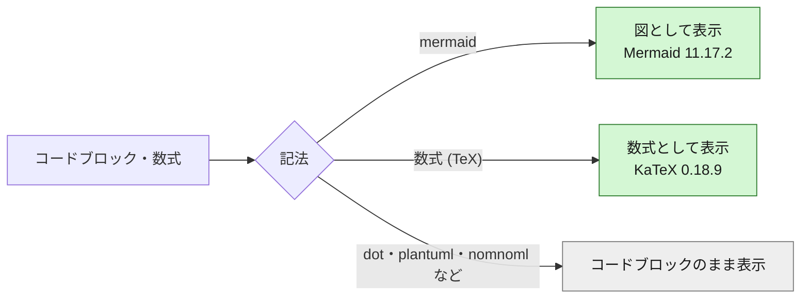
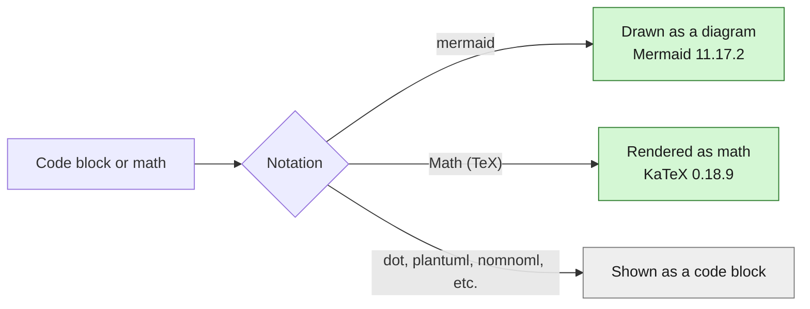

<!--
  File: README.md
  Description: Setup and usage guide for mdEditor
  Author: 5garashi.com設計事務所 / 5garashi.com Design Office
  Created: 2026-10-10
  License: MIT
  SPDX-License-Identifier: MIT
-->
# mdEditor

Windows で Markdown ファイルを開き、テキストと整形済み表示を並べて編集するアプリです。

*A Windows app that opens Markdown files and lets you edit the text side by side with a rendered preview.* [日本語](#セットアップ) / [English](#english)

## セットアップ

1. .NET 10 SDK がインストールされた Windows で、`setup.cmd` をダブルクリックします（PowerShell から `powershell -ExecutionPolicy Bypass -File .\setup.ps1` を実行しても同じです）。`.ps1` はダブルクリックではメモ帳で開くだけで実行されないため、`setup.cmd` から呼び出します。アプリは `%LOCALAPPDATA%\Programs\mdEditor` に発行され、現在のユーザー向けに登録されます。
2. Windows の「設定」→「アプリ」→「既定のアプリ」を開き、`.md` の既定アプリとして `mdEditor` を選びます。
3. `.md` ファイルを開くと、mdEditor の左側にテキスト、右側にプレビューが表示されます。

Windows は既定アプリをユーザーの操作で設定するため、セットアップ後に開く `mdEditor` の既定アプリ設定で、`.md` の既定アプリとして `mdEditor` を選択してください。Windowsの確認なしに既定アプリを変更することはできません。

Microsoft Edge WebView2 Runtime が必要です。Microsoft Edge がインストールされている環境では、通常このランタイムも利用できます。

## 操作

- **開く**: Markdown ファイルを選択します。
- **ドラッグ&ドロップ**: `.md` または `.markdown` ファイルをアプリ画面へ1つドロップして開きます。未保存の変更がある場合は、開く前に確認します。
- **保存**: 現在のファイルに上書きします。新規文書は保存先を選びます。
- **名前を付けて保存**: 保存先とファイル名を選びます。
- **Ctrl+O**: ファイルを開きます。
- **Ctrl+S**: 保存します。
- **Ctrl+Shift+S**: 名前を付けて保存します。
- **PDFに保存**: 整形したプレビューをA4のPDFに書き出します。
- **Ctrl+Shift+P**: PDFに保存します。
- **Ctrl+H**: 編集画面の検索・置換バーを開きます。「置換」「すべて置換」が使えます（`Enter` で次を検索、`Esc` で閉じる）。
- **Ctrl+F**: ウィンドウ標準の検索です。プレビューの検索にも使えます。
- **左右の区切り**: 中央の境界線をドラッグすると編集欄とプレビューの幅を調整できます。区切りをフォーカスして左右矢印キーを押すと、幅を5%ずつ調整します。狭い画面では縦方向の区切りを上下矢印キーで操作します。幅の設定も次回起動時に保持されます。
- **編集画面 / プレビューをウィンドウ全体に表示**: 各欄のボタンで、その欄をウィンドウいっぱいに広げます（OSの全画面にはなりません）。「元の表示に戻す」ボタンまたは `Esc` で並列表示に戻ります。
- **ウィンドウの全画面表示**: `F11` で切り替えます。解除は `F11` または `Esc` です。

Markdown の変更はプレビューに反映されます。未保存の変更がある状態でファイルを開く、またはアプリを閉じると、保存するか確認します。

## 表示言語 / Display language

画面と各種ダイアログは日本語と英語に対応します。初回は OS の表示言語（日本語なら日本語、それ以外は英語）で起動し、ツールバーの「English / 日本語」ボタンでいつでも切り替えられます。選択は次回以降も保持されます。

起動オプションで言語を指定することもできます。指定した言語はその起動の間だけ有効で、保存済みの選択は書き換えません。

```
mdEditor.exe --lang en
mdEditor.exe --lang ja "C:\docs\memo.md"
```

The interface and dialogs support Japanese and English. On first launch the language follows the OS display language (Japanese if it is Japanese, otherwise English). Use the "English / 日本語" button in the toolbar to switch at any time; the choice is remembered. The `--lang en` or `--lang ja` option (also `--lang=en`) sets the language for that launch only and does not overwrite the saved choice. (The same section applies to the English part below.)

## Markdown とプレビュー

見出し、リスト、引用、表、コード、リンク、画像などのMarkdownを表示します。セキュリティのため、Markdown内の生HTMLは表示せず、プレビュー内容をサニタイズします。Webリンクは既定のブラウザー、メールリンクは既定のメールアプリで開きます。PDFには整形済みのプレビューのみを出力し、編集中のテキスト欄や操作ボタンは含めません。

` ```mermaid ` のコードブロックは [Mermaid](https://mermaid.js.org/) で図として表示します（フローチャート、シーケンス図、クラス図、状態遷移図、ER図、ガントチャート、円グラフなど）。`$...$` と `$$...$$` の数式は [KaTeX](https://katex.org/) で表示します。どちらもアプリに同梱しているため、オフラインでも表示でき、PDFにも出力されます。図の構文に誤りがある場合は、エラーメッセージと元のコードを表示します。表示の確認には [samples/diagram-test.md](./samples/diagram-test.md)（英語版: [samples/diagram-test.en.md](./samples/diagram-test.en.md)）を使えます。

### 対応している図・チャート

コードブロックの言語名によって、表示のしかたが次のように変わります。



| 種類 | 記法 | 表示 | 補足 |
| :--- | :--- | :---: | :--- |
| フローチャート | ` ```mermaid ` + `flowchart` / `graph` | ✅ | |
| シーケンス図 | `sequenceDiagram` | ✅ | |
| クラス図 | `classDiagram` | ✅ | |
| 状態遷移図 | `stateDiagram-v2` | ✅ | |
| ER図 | `erDiagram` | ✅ | |
| ガントチャート | `gantt` | ✅ | |
| 円グラフ | `pie` | ✅ | |
| 棒グラフ・折れ線グラフ | `xychart-beta` | ✅ | 軸の日本語ラベルは `"1月"` のように `"..."` で囲みます |
| 4象限チャート | `quadrantChart` | ✅ | |
| ユーザージャーニー | `journey` | ✅ | |
| Git グラフ | `gitGraph` | ✅ | |
| マインドマップ | `mindmap` | ✅ | |
| タイムライン | `timeline` | ✅ | |
| サンキーダイアグラム | `sankey-beta` | ✅ | ノード名は英数字のみ（Mermaid の制限で、日本語は使えません） |
| 数式 | `$...$`（インライン）、`$$...$$`（ブロック） | ✅ | KaTeX で表示 |
| Graphviz | ` ```dot ` | ❌ | コードブロックとして表示 |
| PlantUML | ` ```plantuml ` | ❌ | コードブロックとして表示 |
| nomnoml | ` ```nomnoml ` | ❌ | コードブロックとして表示 |

上の表で ✅ の図は、テスト文書で表示を確認済みです。これ以外の Mermaid の図（`block-beta` など）も Mermaid 11.17.2 が対応していれば表示されますが、確認はしていません。

## デザインと公式素材

画面デザインは5garashi.com Design Office Identity v4.7（2026-10-08）に基づきます。公式ロゴタイプとシンプル版マークは [5garashi/5garashi-identity](https://github.com/5garashi/5garashi-identity) のSVG素材を改変せずに同梱し、アプリのウィンドウ・実行ファイル・Markdown関連付けのアイコンにはシンプル版マークを使用します。各SVGファイルに記載された作者、著作権、CC BY-ND 4.0 ライセンスを保持しています。

## ライセンス

ソースコードは [MIT License](./LICENSE) です（Identity 第12-1条）。`wwwroot/assets/` のロゴタイプとシンボルマークは MIT の対象外で、CC BY-ND 4.0 で提供されます。名称とロゴに関する権利は留保され、公式の提供物・承認・提携と誤認される使い方はできません（第12-2条）。

`wwwroot/lib/` には、それぞれの MIT License のもとで Mermaid 11.17.2 と KaTeX 0.18.9 を改変せずに同梱しています。ライセンス文は各フォルダーの `LICENSE` にあります。

## English

[日本語](#セットアップ) / English

### Setup

1. On Windows with the .NET 10 SDK installed, double-click `setup.cmd` (or run `powershell -ExecutionPolicy Bypass -File .\setup.ps1` from PowerShell). Double-clicking a `.ps1` file only opens it in Notepad, so `setup.cmd` runs it for you. The app is published to `%LOCALAPPDATA%\Programs\mdEditor` and registered for the current user.
2. Open Windows Settings, Apps, Default apps, and choose `mdEditor` as the default app for `.md`.
3. When you open a `.md` file, mdEditor shows the text on the left and the preview on the right.

Windows requires the user to set default apps, so choose `mdEditor` for `.md` in the Settings page that opens after setup. An app cannot change the default without the user's confirmation.

Microsoft Edge WebView2 Runtime is required. It is normally available wherever Microsoft Edge is installed.

### Usage

- **Open**: choose a Markdown file.
- **Drag and drop**: drop one `.md` or `.markdown` file onto the window to open it. If there are unsaved changes, you are asked before it opens.
- **Save**: overwrite the current file. A new document asks where to save.
- **Save As**: choose a location and file name.
- **Ctrl+O**: open a file.
- **Ctrl+S**: save.
- **Ctrl+Shift+S**: save as.
- **Save as PDF**: export the rendered preview as an A4 PDF.
- **Ctrl+Shift+P**: save as PDF.
- **Ctrl+H**: open the editor's find/replace bar with Replace and Replace all (`Enter` finds next, `Esc` closes).
- **Ctrl+F**: the standard window find, which also works in the preview.
- **Pane divider**: drag the center divider to resize the editor and the preview. Focus the divider and press the left or right arrow keys to resize in 5% steps. On narrow windows the divider is vertical and uses the up and down arrow keys. The width is remembered for the next launch.
- **Fill window with editor / preview**: each pane has a button that expands that pane to fill the app window (not OS full screen). Return with "Restore layout" or `Esc`.
- **Window full screen**: toggle with `F11`; exit with `F11` or `Esc`.

Changes in the Markdown are reflected in the preview. If there are unsaved changes when you open a file or close the app, you are asked whether to save.

### Markdown and preview

Headings, lists, quotes, tables, code, links, and images are rendered. For security, raw HTML inside Markdown is not displayed and the preview content is sanitized. Web links open in the default browser and mail links in the default mail app. The PDF contains only the rendered preview, not the editing text area or buttons.

` ```mermaid ` code blocks are drawn as diagrams with [Mermaid](https://mermaid.js.org/) (flowcharts, sequence, class, state, ER, Gantt, pie charts, and more). Math in `$...$` and `$$...$$` is rendered with [KaTeX](https://katex.org/). Both are bundled with the app, so they work offline and are included in PDFs. A diagram with a syntax error shows the error message and its source. Use [samples/diagram-test.en.md](./samples/diagram-test.en.md) (Japanese: [samples/diagram-test.md](./samples/diagram-test.md)) to check the rendering.

#### Supported diagrams and charts

How a block is rendered depends on the language name of the code block.



| Type | Syntax | Rendered | Notes |
| :--- | :--- | :---: | :--- |
| Flowchart | ` ```mermaid ` + `flowchart` / `graph` | ✅ | |
| Sequence diagram | `sequenceDiagram` | ✅ | |
| Class diagram | `classDiagram` | ✅ | |
| State diagram | `stateDiagram-v2` | ✅ | |
| ER diagram | `erDiagram` | ✅ | |
| Gantt chart | `gantt` | ✅ | |
| Pie chart | `pie` | ✅ | |
| Bar and line chart | `xychart-beta` | ✅ | Quote non-ASCII axis labels, such as `"1月"` |
| Quadrant chart | `quadrantChart` | ✅ | |
| User journey | `journey` | ✅ | |
| Git graph | `gitGraph` | ✅ | |
| Mind map | `mindmap` | ✅ | |
| Timeline | `timeline` | ✅ | |
| Sankey diagram | `sankey-beta` | ✅ | ASCII node names only (a Mermaid limitation) |
| Math | `$...$` (inline), `$$...$$` (display) | ✅ | Rendered with KaTeX |
| Graphviz | ` ```dot ` | ❌ | Shown as a code block |
| PlantUML | ` ```plantuml ` | ❌ | Shown as a code block |
| nomnoml | ` ```nomnoml ` | ❌ | Shown as a code block |

Everything marked ✅ is verified with the test documents. Other Mermaid diagrams (such as `block-beta`) render if Mermaid 11.17.2 supports them, but they have not been checked.

### Design and official assets

The screen design follows the 5garashi.com Design Office Identity v4.7 (2026-10-08). The official logotype and simple symbol mark are bundled unmodified from the SVG assets of [5garashi/5garashi-identity](https://github.com/5garashi/5garashi-identity). The simple mark is used for the window, the executable, and the Markdown file association icons. The author, copyright, and CC BY-ND 4.0 license stated in each SVG file are preserved.

### License

The source code is under the [MIT License](./LICENSE) (Identity Art. 12-1). The logotype and symbol mark in `wwwroot/assets/` are not covered by MIT and are provided under CC BY-ND 4.0. All rights in the name and logos are reserved, and they may not be used in a way that implies official origin, endorsement, or affiliation (Art. 12-2).

`wwwroot/lib/` bundles Mermaid 11.17.2 and KaTeX 0.18.9 unmodified under their MIT Licenses. The license texts are in the `LICENSE` file in each folder.

---

**作成者 / Author**: 5garashi.com設計事務所 / 5garashi.com Design Office
**最終更新 / Last updated**: 2026-10-10 JST
