# Diagram and Chart Rendering Test

This test document checks that diagrams and charts render correctly in the mdEditor preview.
Compare the "Expected" note in each section with the actual preview.

---

## 1. Flowchart (Mermaid flowchart)

Expected: a top-to-bottom flowchart with branches, a diamond decision node, and colored nodes.

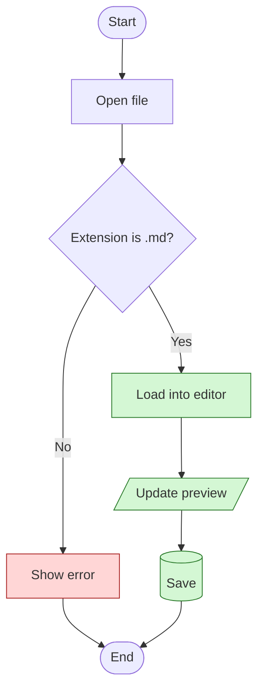

### 1-2. Left to right with subgraphs

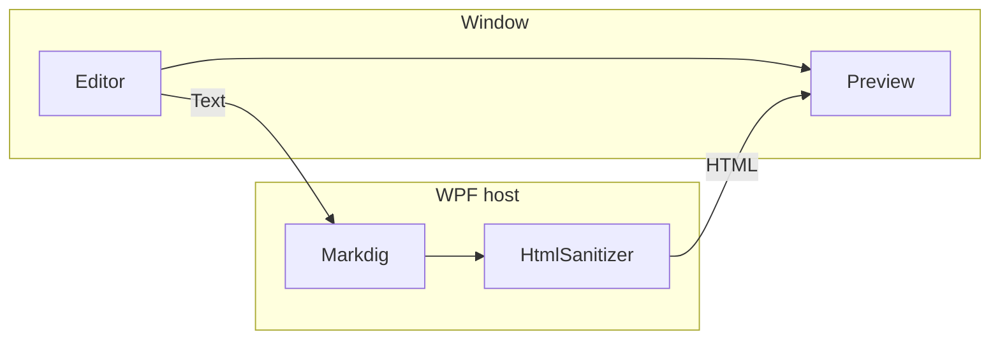

---

## 2. Sequence diagram (Mermaid sequenceDiagram)

Expected: four participants, synchronous and asynchronous arrows, loop and alt frames, and a note.

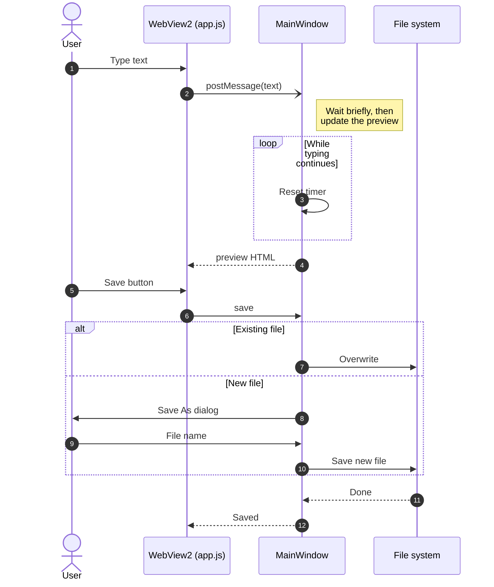

---

## 3. Class diagram (Mermaid classDiagram)

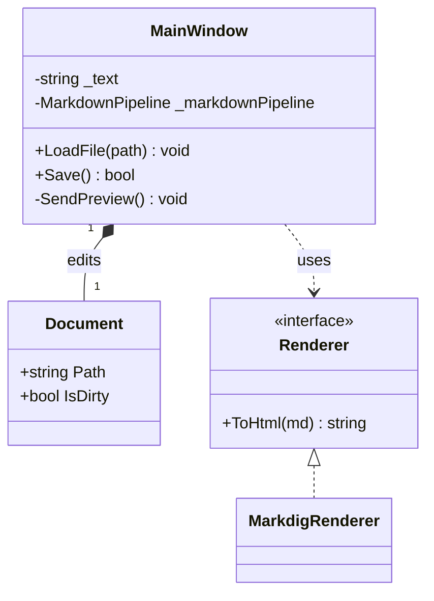

---

## 4. State diagram (Mermaid stateDiagram)

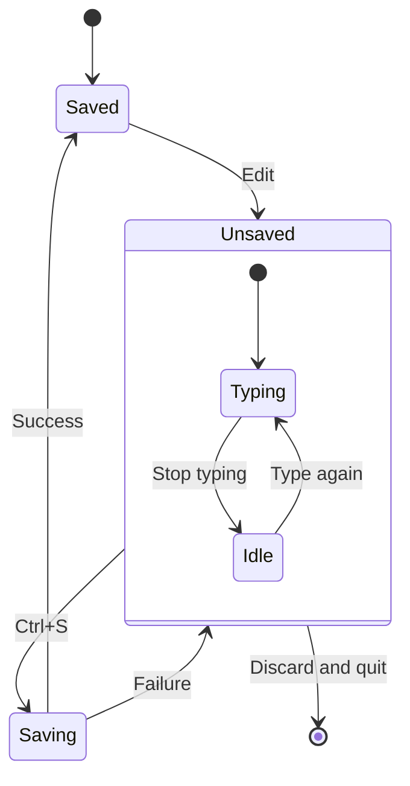

---

## 5. ER diagram (Mermaid erDiagram)

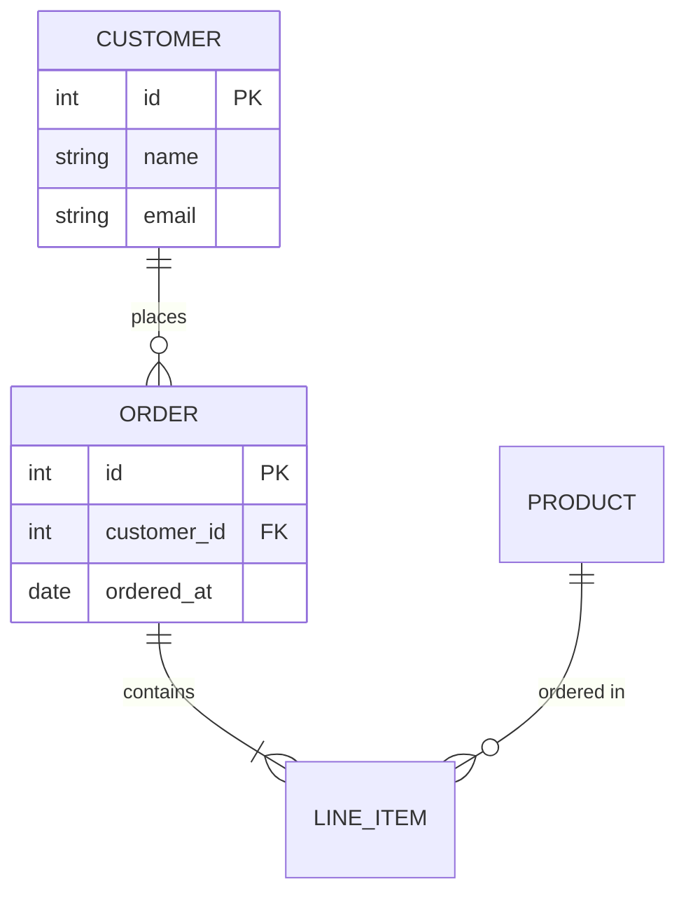

---

## 6. Gantt chart (Mermaid gantt)

Expected: dates on the horizontal axis, bars colored by section, and done, active, and critical tasks.

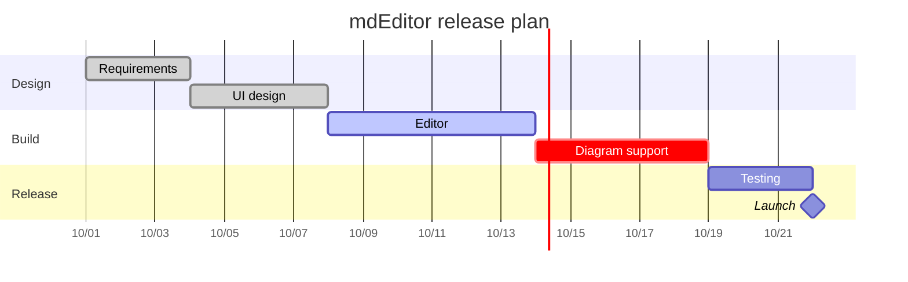

---

## 7. Pie chart (Mermaid pie)

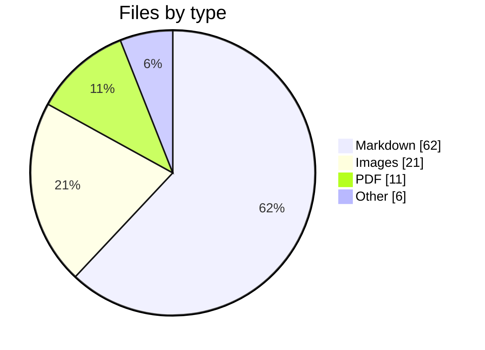

---

## 8. Bar and line chart (Mermaid xychart-beta)

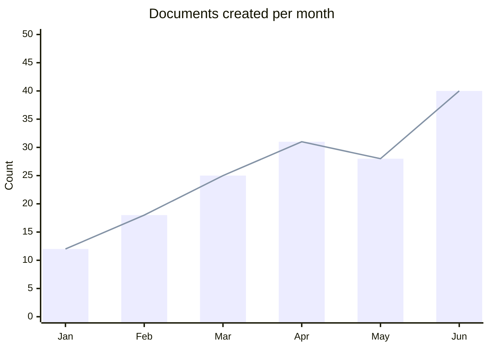

---

## 9. Quadrant chart (Mermaid quadrantChart)

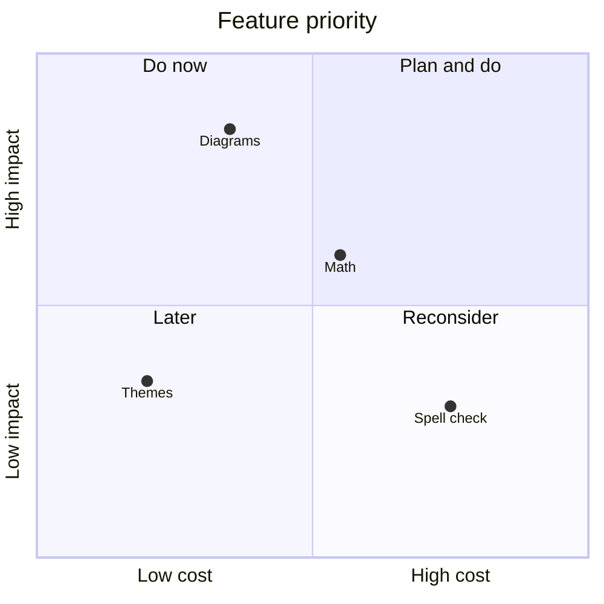

---

## 10. User journey (Mermaid journey)

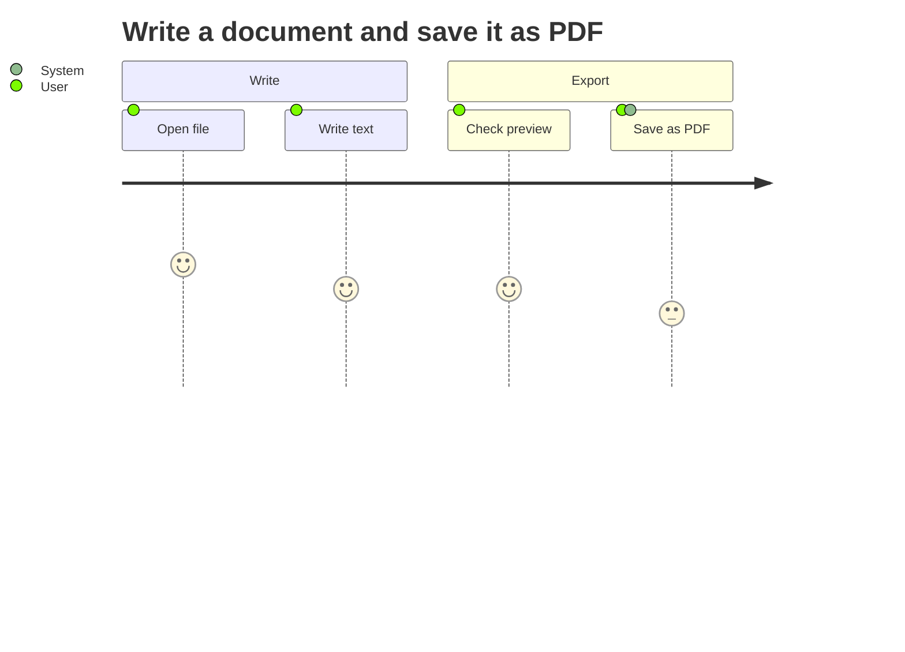

---

## 11. Git graph (Mermaid gitGraph)

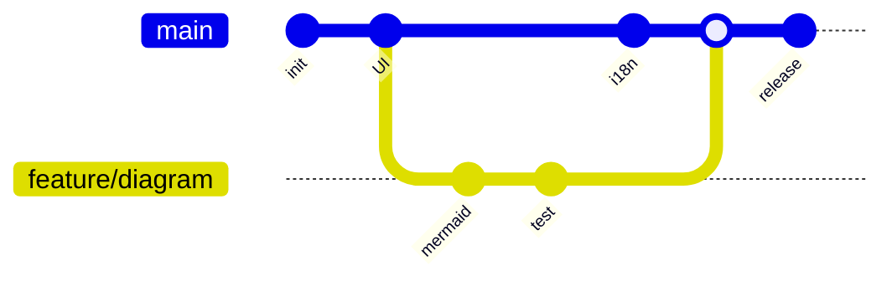

---

## 12. Mind map (Mermaid mindmap)

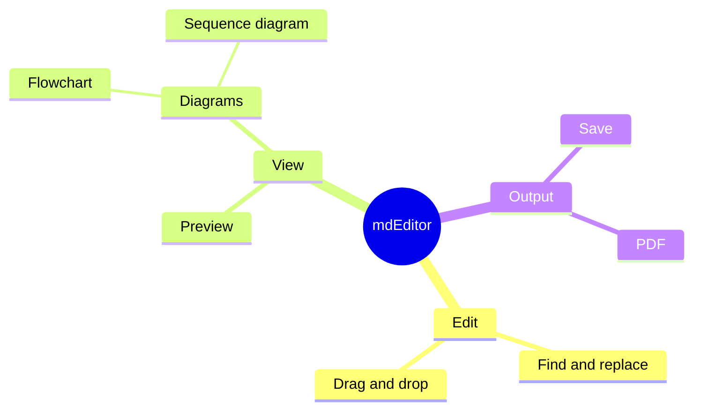

---

## 13. Timeline (Mermaid timeline)

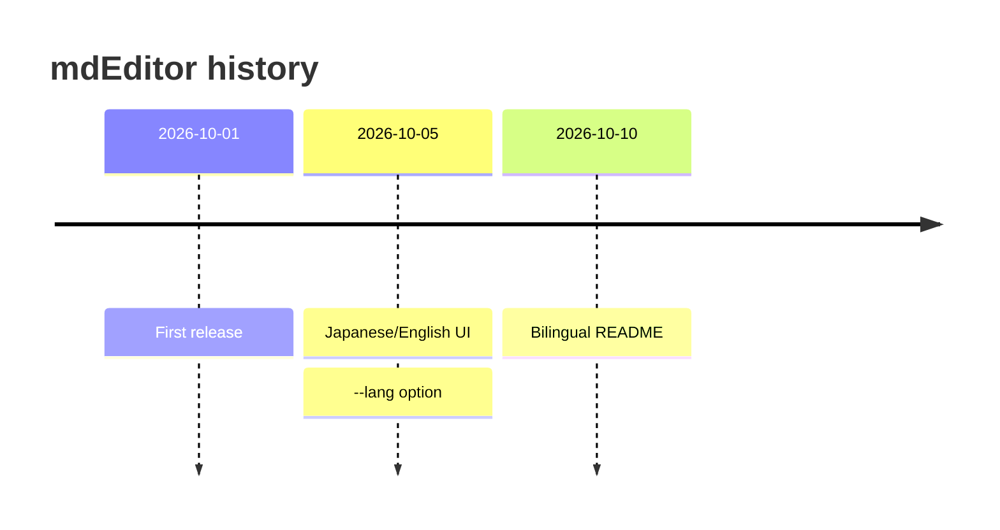

---

## 14. Sankey diagram (Mermaid sankey-beta)

Mermaid sankey supports only ASCII node names.

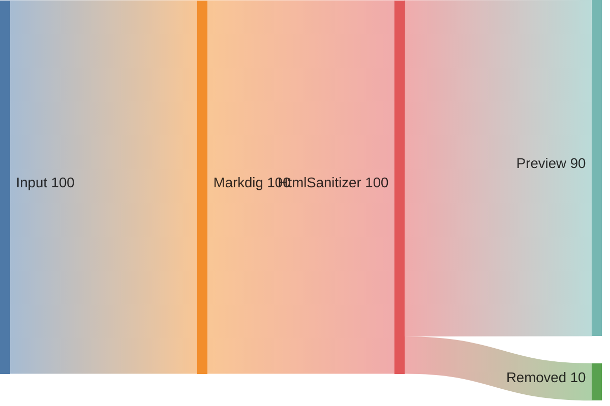

---

## 15. Mermaid syntax error (error display check)

Expected: the app does not freeze, an error message and the source are shown, and other diagrams are unaffected.

```mermaid
flowchart TD
    A --> B --
    this is broken syntax {{{
```

---

## 16. Other diagram notations (rendered only if supported)

### 16-1. Graphviz (dot)

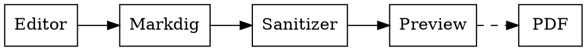

### 16-2. PlantUML

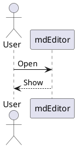

### 16-3. nomnoml

```nomnoml
[Editor]->[Preview]
[Preview]->[PDF]
```

---

## 17. Math (KaTeX / MathJax)

Inline math: $E = mc^2$, $\sum_{i=1}^{n} i = \frac{n(n+1)}{2}$

Display math:

$$
\int_{-\infty}^{\infty} e^{-x^2}\,dx = \sqrt{\pi}
$$

$$
\begin{pmatrix} a & b \\ c & d \end{pmatrix}
\begin{pmatrix} x \\ y \end{pmatrix}
=
\begin{pmatrix} ax + by \\ cx + dy \end{pmatrix}
$$

---

## 18. For comparison: not diagrams (check that nothing breaks)

### 18-1. Regular code block

```javascript
// Mentions mermaid, but a different language must not become a diagram
const text = "flowchart TD; A --> B";
console.log(text);
```

### 18-2. Code block without a language

```
graph TD
    A --> B
```

### 18-3. Text diagram (columns should line up in monospace)

```text
+--------+      +---------+      +----------+
| Editor | ---> | Markdig | ---> | Preview  |
+--------+      +---------+      +----------+
```

### 18-4. Table

| Diagram type | Syntax | Result |
|:---|:---:|---:|
| Flowchart | `flowchart` | ☐ |
| Sequence diagram | `sequenceDiagram` | ☐ |
| Class diagram | `classDiagram` | ☐ |
| State diagram | `stateDiagram-v2` | ☐ |
| ER diagram | `erDiagram` | ☐ |
| Gantt | `gantt` | ☐ |
| Pie chart | `pie` | ☐ |
| Math | `$...$` | ☐ |

---

## Checklist

- [ ] Every Mermaid diagram renders as a drawing, not as code
- [ ] Labels render without garbled characters or overflow
- [ ] A diagram with a syntax error does not stop the others from rendering
- [ ] Diagrams redraw while editing without flicker or scroll jumps
- [ ] Diagrams do not overflow a narrow preview (or can be scrolled)
- [ ] "Save as PDF" includes the diagrams in the PDF
- [ ] Diagrams render offline
