# 図・チャート表示テスト

mdEditor のプレビューで、各種ダイアグラムやチャートが正しく表示されるかを確認するためのテスト文書です。
各セクションの「期待される表示」と実際のプレビューを見比べてください。

---

## 1. フローチャート（Mermaid flowchart）

期待される表示：上から下へ流れる分岐付きのフローチャート。ひし形の判定ノードと、色付きのノードがある。

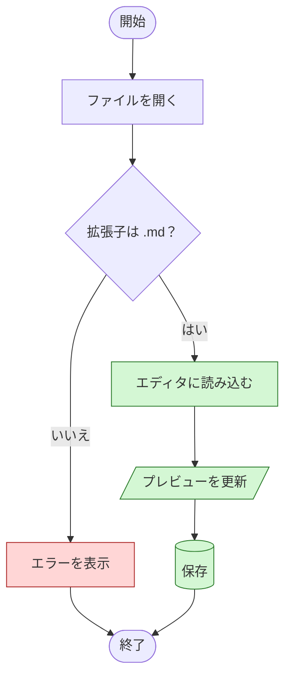

### 1-2. 左から右・サブグラフ

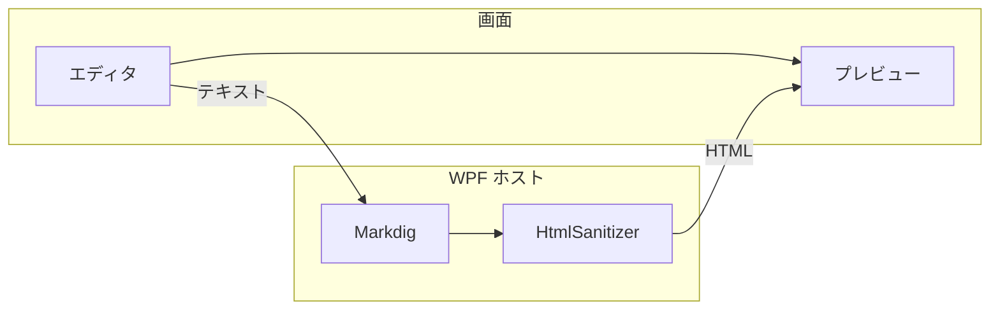

---

## 2. シーケンス図（Mermaid sequenceDiagram）

期待される表示：4 人の参加者、同期/非同期の矢印、ループ・分岐の枠、注記。

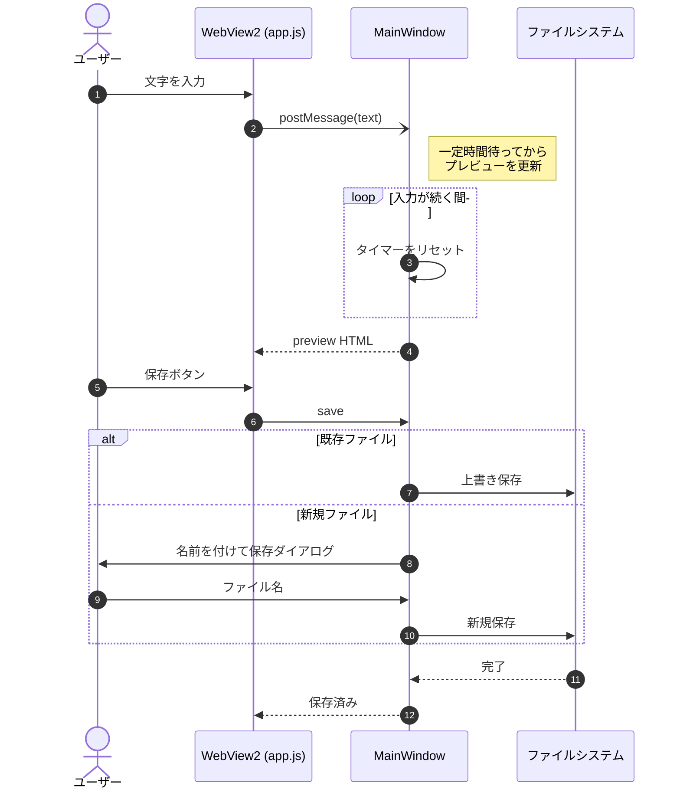

---

## 3. クラス図（Mermaid classDiagram）

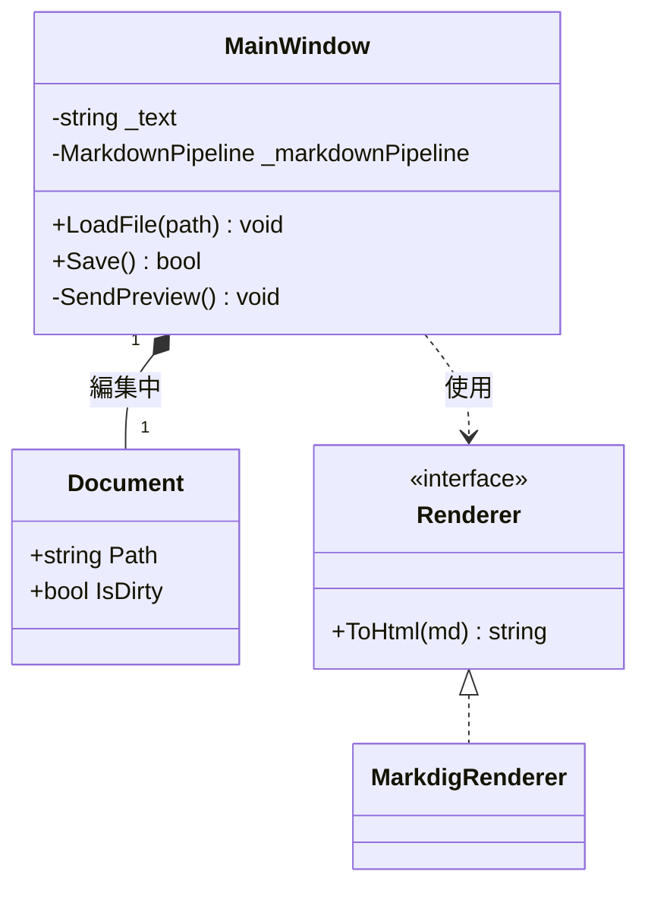

---

## 4. 状態遷移図（Mermaid stateDiagram）

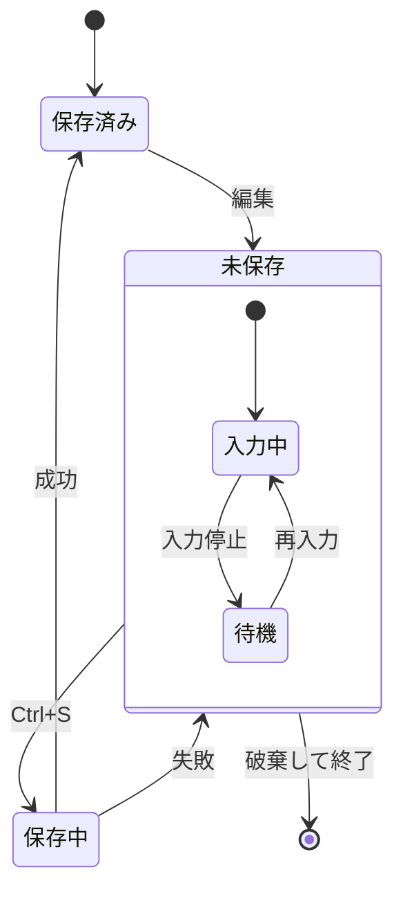

---

## 5. ER 図（Mermaid erDiagram）

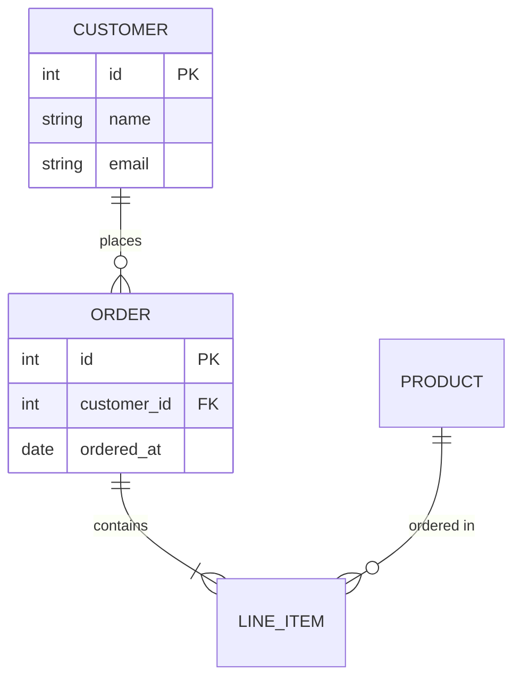

---

## 6. ガントチャート（Mermaid gantt）

期待される表示：横軸が日付、セクションごとに色分けされたバー。完了・進行中・重要タスクの表現。

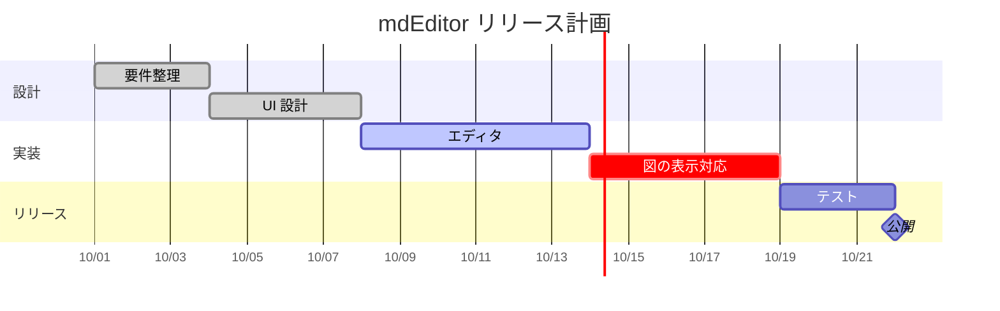

---

## 7. 円グラフ（Mermaid pie）

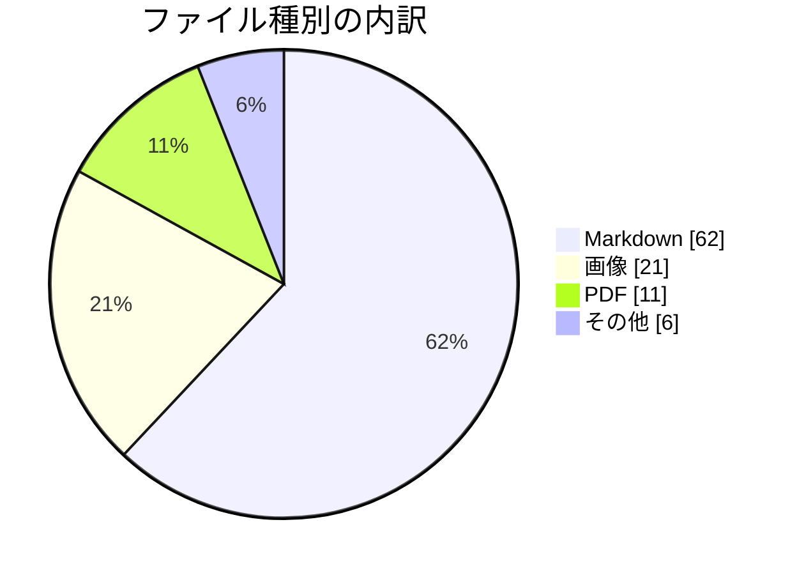

---

## 8. 棒グラフ・折れ線グラフ（Mermaid xychart-beta）

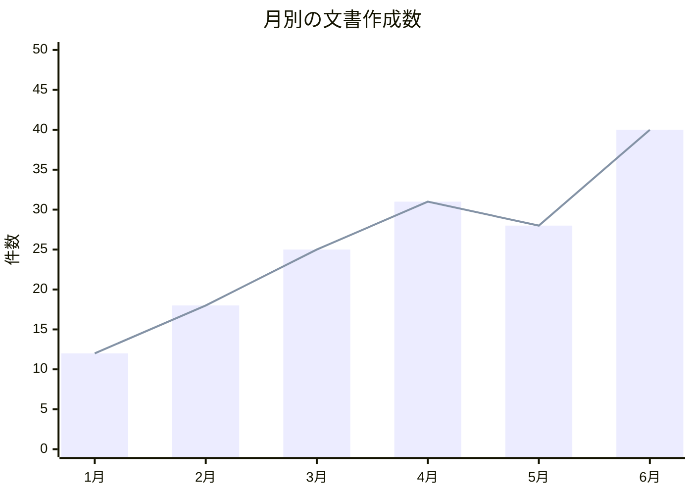

---

## 9. 4 象限チャート（Mermaid quadrantChart）

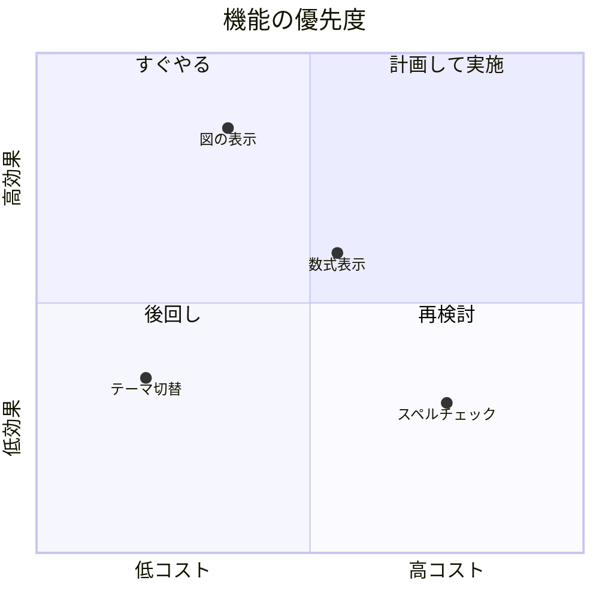

---

## 10. ユーザージャーニー（Mermaid journey）

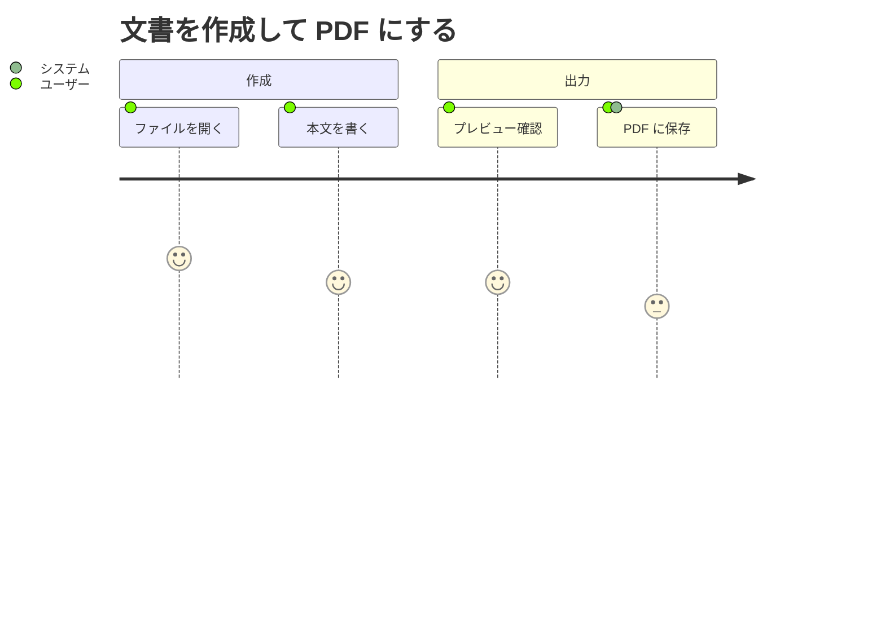

---

## 11. Git グラフ（Mermaid gitGraph）

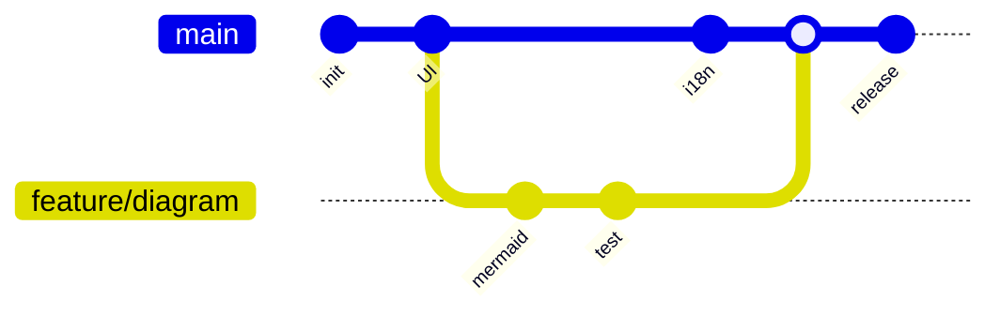

---

## 12. マインドマップ（Mermaid mindmap）

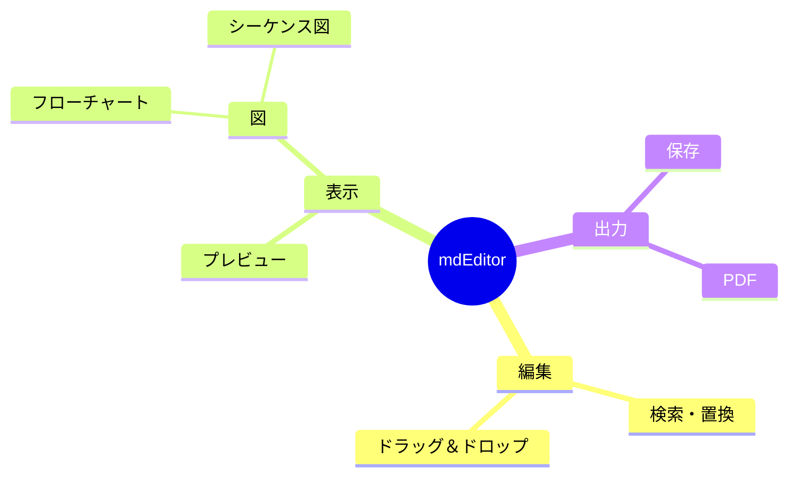

---

## 13. タイムライン（Mermaid timeline）

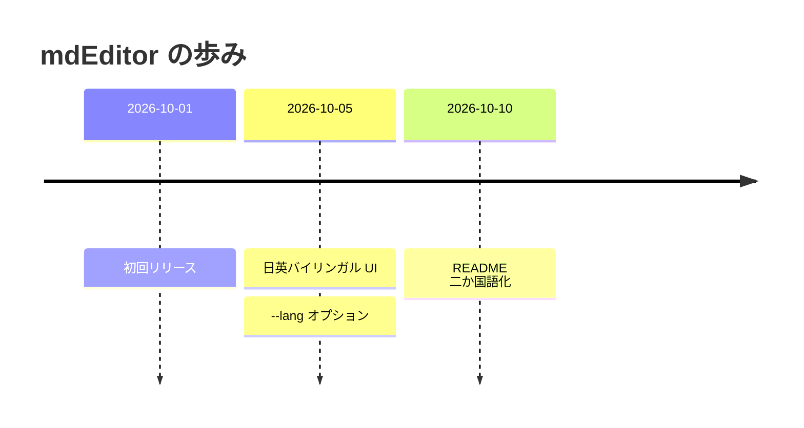

---

## 14. サンキーダイアグラム（Mermaid sankey-beta）

Mermaid のサンキーは日本語などの非 ASCII 文字の名前に対応していないため、英数字の名前を使います。

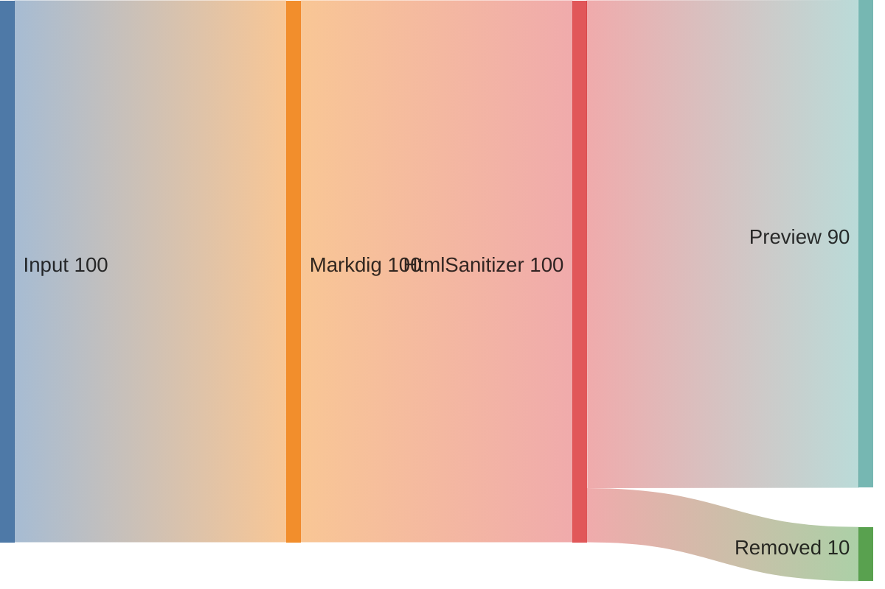

---

## 15. Mermaid の構文エラー（エラー表示の確認）

期待される表示：アプリが固まらず、エラーメッセージまたは元のコードが表示される。他の図の表示に影響しない。

```mermaid
flowchart TD
    A --> B --
    これは壊れた構文です {{{
```

---

## 16. その他の図の記法（対応していれば表示）

### 16-1. Graphviz（dot）

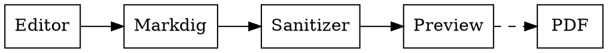

### 16-2. PlantUML

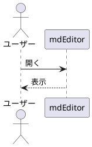

### 16-3. nomnoml

```nomnoml
[Editor]->[Preview]
[Preview]->[PDF]
```

---

## 17. 数式（KaTeX / MathJax）

インライン数式： $E = mc^2$ 、 $\sum_{i=1}^{n} i = \frac{n(n+1)}{2}$

ブロック数式：

$$
\int_{-\infty}^{\infty} e^{-x^2}\,dx = \sqrt{\pi}
$$

$$
\begin{pmatrix} a & b \\ c & d \end{pmatrix}
\begin{pmatrix} x \\ y \end{pmatrix}
=
\begin{pmatrix} ax + by \\ cx + dy \end{pmatrix}
$$

---

## 18. 比較用：図ではないもの（崩れないことの確認）

### 18-1. 普通のコードブロック

```javascript
// mermaid と書かれていても、言語が違えば図にしない
const text = "flowchart TD; A --> B";
console.log(text);
```

### 18-2. 言語指定なしのコードブロック

```
graph TD
    A --> B
```

### 18-3. テキストの図（等幅で揃っていること）

```text
+--------+      +---------+      +----------+
| Editor | ---> | Markdig | ---> | Preview  |
+--------+      +---------+      +----------+
```

### 18-4. 表

| 図の種類 | 記法 | 確認結果 |
|:---|:---:|---:|
| フローチャート | `flowchart` | ☐ |
| シーケンス図 | `sequenceDiagram` | ☐ |
| クラス図 | `classDiagram` | ☐ |
| 状態遷移図 | `stateDiagram-v2` | ☐ |
| ER 図 | `erDiagram` | ☐ |
| ガント | `gantt` | ☐ |
| 円グラフ | `pie` | ☐ |
| 数式 | `$...$` | ☐ |

---

## 確認チェックリスト

- [ ] すべての Mermaid 図がコードではなく図として表示される
- [ ] 日本語のラベルが文字化け・はみ出しせずに表示される
- [ ] 構文エラーの図があっても他の図は表示される
- [ ] 編集中に図が再描画され、ちらつきやスクロール位置の飛びがない
- [ ] 幅の狭いプレビューでも図が横にはみ出さない（またはスクロールできる）
- [ ] 「PDFに保存」で図が PDF に含まれる
- [ ] オフライン環境でも図が表示される
